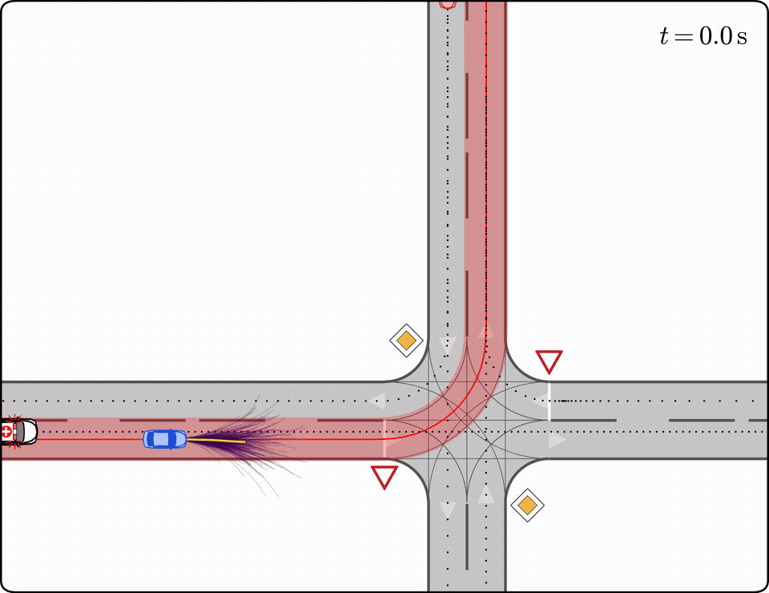

# STL-Lex-MPPI-Planner

Code to reproduce the numerical experiments from:

Patrick Halder, Lothar Kiltz, Hannes Homburger, Johannes Reuter, Matthias Althoff,
"Lexicographic Minimum-Violation Motion Planning using Signal Temporal Logic,"
IEEE Open Journal of Intelligent Transportation Systems, 2026.
DOI: https://doi.org/10.1109/OJITS.2026.3726082

## Teaser Video



Full video: [cr_scenario.mp4](cr_scenario.mp4)

## Repository Structure (Experiment Reproduction)

This repository has two main experiment directories:

1. [effects-of-discretization-and-solver-evaluations](effects-of-discretization-and-solver-evaluations)
	 - Contains the experiments for:
		 - effects of discretization,
		 - MPPI solver adaptations,
		 - comparison of robustness measures
	 - Installation and usage instructions are in its local README.

2. [commonroad-evaluations](commonroad-evaluations)
	 - Contains the CommonRoad experiments:
		 - intersection scenario evaluation,
		 - comparison with preemptive planning,
		 - comparison with alternative solvers on CommonRoad scenarios.
	 - Installation and usage instructions are in its local README.

## Contact

Patrick Halder: patrick.halder@tum.de

## Citation

```bibtex
@ARTICLE{11664127,
	author={Halder, Patrick and Kiltz, Lothar and Homburger, Hannes and Reuter, Johannes and Althoff, Matthias},
	journal={IEEE Open Journal of Intelligent Transportation Systems},
	title={Lexicographic Minimum-Violation Motion Planning using Signal Temporal Logic},
	year={2026},
	volume={},
	number={},
	pages={1-1},
	doi={10.1109/OJITS.2026.3726082}
}
```
